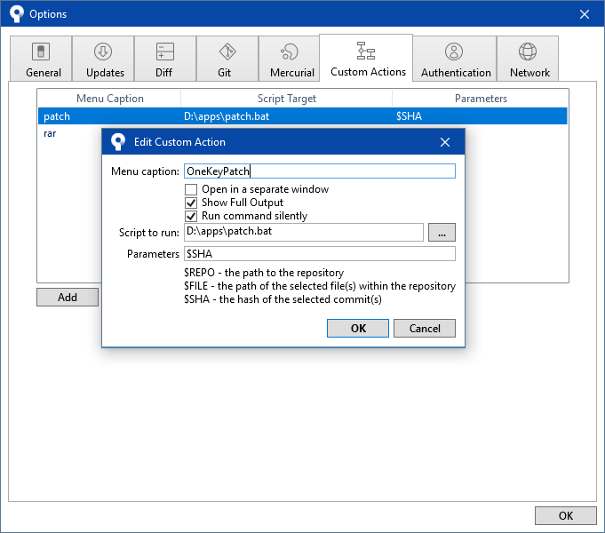
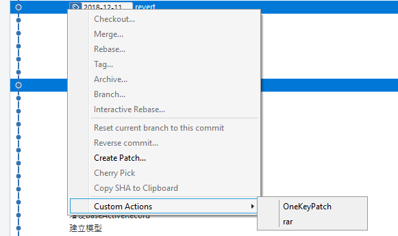
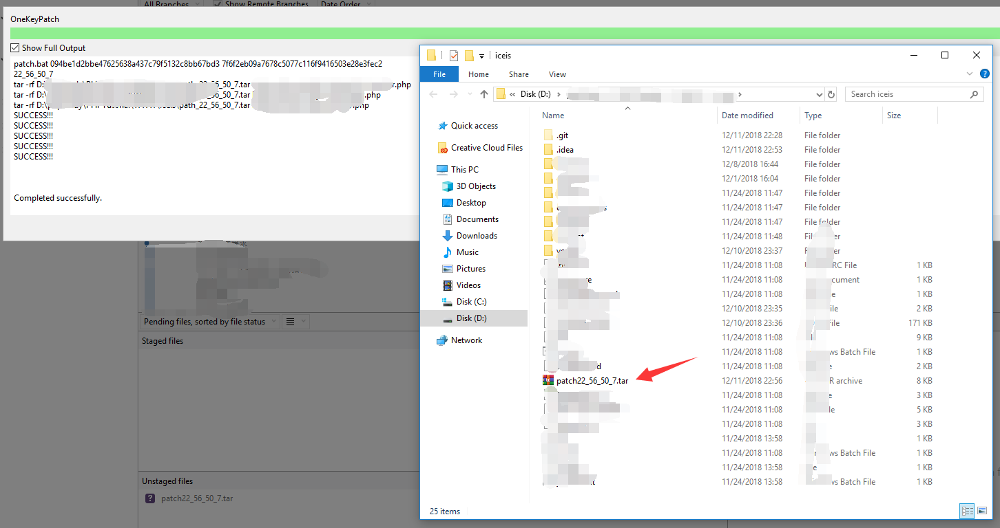

# OneKeyPatch
one key patch via sourcetree custom actions

本脚本旨在为打包上线人员提供方便

## ======= 使用方法 =======

### 1.根据windows系统版本选择bat脚本

> 注：windows7不支持原生tar命令
所以需要安装winrar（一般系统都带了）
并winrar安装根目录添加到系统环境变量中
以支持rar命令

> 设置环境变量后需重启sourcetree生效

### 2. 在sourcetree中添加custom action

> 菜单：Tools -> Options -> Custom Actions -> Add

> Menu caption:随便填，如：OneKeyPatch
Show Full Output:建议勾选，可以看命令执行的详情
Script to Run:点击后面的'...'，选中上一步的bat脚本
Parameters:填写$SHA

### 3. 使用
 
> 选中git历史中的任意2条commit，
右键->Custon Actions->OneKeyPatch，

> 自动打包成压缩文件，
并且自动弹出打包文件所在文件夹。

## ======= 已知问题 =======

> 和Linux下的 git diff xargs tar -zcvf | xargs tar -zcvf 一样
如果两个commit的差异包含文件重命名、文件移动的操作，
git diff 会认为是原文件发生了改变，
所以差异包中不会包含对应的新的文件。

From Variflight
